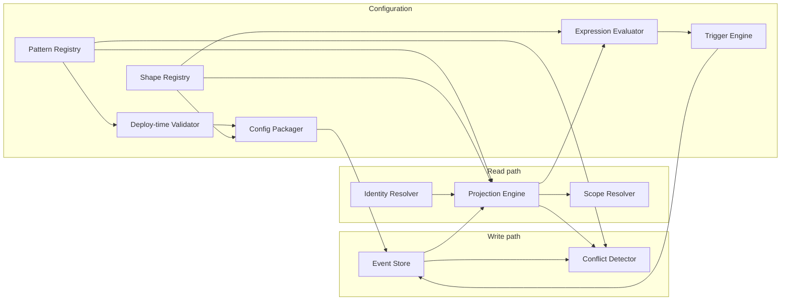

# Architecture Reach Brief

Concise reach picture for ADR-002 through ADR-005: strategic frame, named engineering components, per-ADR bets, interactions, and thickness. For constraints and build rules, use `[../professional-baseline/04-architecture-baseline-v0.md](../professional-baseline/04-architecture-baseline-v0.md)`.

**Index:** `[adr-exploration-crossref.md](adr-exploration-crossref.md)` · **Authority:** `[README.md](README.md)`

---

## Layer 0 — North star

### What Datarun is betting on

Comparable platforms (DHIS2, CommCare, ODK, OpenSRP) each started with one strong primitive and bolted on others. The recurring failures—configuration becoming a specialist discipline, form-only workflow, flat or non-composable models, hostile offline conflict UX, weak schema evolution under long offline periods—point to one opportunity ([01-architecture-landscape.md](../../exploration/archive/01-architecture-landscape.md) §2, §139):

**Treat capture, identity, workflow, assignment, oversight, and cross-referencing as composable peers in one domain-agnostic model**, not as extensions of a single mechanism (forms, metadata tuples, or FHIR resources).

### Constraint survivors (architecture families)

`[After vision](../../README.md)` and `[operational constraints](../../constraints.md)`, viable designs should support (`[01-architecture-landscape.md](../../exploration/archive/01-architecture-landscape.md)` §1):

- Thick client with substantial on-device logic and storage
- Interpreted configuration, not hard-coded behavior per deployment
- Immutable / append-only records with explicit conflict handling
- Selective sync (devices do not carry the full dataset)
- Composable configuration that can grow without breaking existing records
- The platform feels like one coherent system, not a collection of disconnected tools (same concepts, same contracts, same ways of seeing what happened and what's pending — regardless of whether the work is a simple monthly report or a complex multi-level flow).

### Principles as decision tests

| Principle | Test when reviewing a design |
| --- | --- |
| P1 Offline is the default | Does any field behavior require connectivity? |
| P2 Configuration has boundaries | Is this platform-fixed mechanism or deployer parametrization? |
| P3 Append-only | Does this rewrite or delete history? |
| P4 Patterns compose | New behavior via composition, not a one-off mechanism? |
| P5 Conflict surfaced | Anomalies become flags/events, not silent fixes? |
| P6 Authority contextual | Can we audit event → actor → assignment → scope? |
| P7 Simplest stays simple | Does S00 stay ~one capture + sync with no extra machinery? |

All seven confirmed through ADR-001–005 (`[principles.md](../../principles.md)`).

### Viability conditions (exploration phase)

viability conditions: (`[viability-assessment.md](../../viability-assessment.md)`)

| # | Condition | Met (evidence) |
| --- | --- | --- |
| 1 | Configuration boundary among first major architecture decisions | ADR-004 four-layer gradient + budgets (checkpoint-2026-04-13) |
| 2 | S12 strictly scoped (no unbounded rules engine) | ADR-004 S5, S12 — server-only triggers, DAG depth 2 |
| 3 | Phase 2 scenarios deferred | S15, S16, S18 remain deferred |

### Upstream from ADR-001 (context only)

ADR-001 locked: append-only event log, client UUIDs, sync unit = event, projections rebuildable from events. ADR-002–005 extended the envelope and behavior on that foundation without replacing it.

---

## Layer 1 — System topology

### Eleven engineering components

Consolidated from `[22-platform-primitives-inventory.md](../../exploration/22-platform-primitives-inventory.md)` and routed for atomization via `[07-system-boundary-map.md](../professional-baseline/07-system-boundary-map.md)`. These are **components**, not charter-level “primitives” (see `[README.md](README.md)`).

| Component | Invariant (one line) | Primary ADRs |
| --- | --- | --- |
| Event Store | Sole append-only write path; 11-field envelope | 001, 002, 004 |
| Projection Engine | Current state = f(events); rebuildable | 001, 002, 003, 005 |
| Identity Resolver | 4 typed categories; merge=alias; DAG lineage | 002 |
| Conflict Detector | Accept-and-flag; detect-before-act; single-writer resolution | 002, 003, 005 |
| Scope Resolver | Assignment-based access; sync scope = access scope | 003, 004 |
| Shape Registry | Typed versioned shapes; deprecation-only evolution | 004 |
| Expression Evaluator | Operators + field refs; form vs trigger contexts | 004, 005 |
| Trigger Engine | Server-only L3a/L3b; bounded DAG | 004, 005 |
| Deploy-time Validator | Hard complexity budgets; reject invalid config | 004, 005 |
| Config Packager | Atomic config delivery; ≤2 versions on device | 004 |
| Pattern Registry | Platform-fixed workflow skeletons; deployer parameterizes | 005 |

### Interaction sketch (decided contracts)

Derived from `[26-contract-extraction.md](../../exploration/26-contract-extraction.md)` — 21 contracts, no inventions.

**Sync-critical ordering (behavioral, not implementation):**

1. Persist event (ES) — never reject for staleness (ADR-002 S14).
2. Detect conflicts on raw references before policies/state (ADR-002 S12; ADR-003 S7).
3. Derive projections excluding unresolved flags from state machines (ADR-005 S2).
4. Filter sync by assignment scope (ADR-003 S2).
5. Triggers fire server-only; outputs re-enter the same pipeline (ADR-004 S5).

### Historical note

`[architecture/primitives.md](../../architecture/primitives.md)` mirrors this component set but is marked **historical** (pre-charter / ADR-009). Prefer boundary map + this brief for naming; prefer baseline v0 for behavior.

---

## Layer 2 — Per-ADR strategy briefs

### ADR-002 — Identity & Conflict Resolution

**Leading question:** How do offline-created identities stay coherent, merge safely, and surface conflicts without rejecting field work?

**Decision character:** Infrastructure + envelope — second most irreversible after storage (`[checkpoint-2026-04-10](../../checkpoints/checkpoint-2026-04-10.md)`).

**Strategic bets:**

- Four typed identity categories share one protocol but different lifecycles (subject, actor, process, assignment).
- Causal order is device-local (`device_seq`) + concurrency (`sync_watermark`), not wall clock.
- Merge is alias-in-projection; history is never rewritten.
- Accept-and-flag: valid events are always stored; anomalies are separate flag events.
- Merge/split are coordinator online operations; duplicate registration offline is OK and reconciled on sync.

**Parts named in exploration:**

| Name | Role | Still accurate? |
| --- | --- | --- |
| Subject / Actor / Process / Assignment | Identity taxonomy | Yes — ADR-002 S2 |
| Subject Identity Resolver | Alias table, lineage DAG | Yes — Identity Resolver |
| Conflict Detector | Flags + detect-before-act | Yes — expanded in 003/005 |
| Event aggregate | Immutable event stream | Yes — Event Store |
| Shipment (process aggregate) | Transient workflow-scoped identity | Yes — process type |

**Irreversible surface:** +`device_id`, `device_seq`, `sync_watermark`, typed `subject_ref` / `actor_ref`; `timestamp` advisory only. Envelope **9** fields.

**Locked (structural):** S1–S9, S13–S14 — see [ADR-002 traceability](../../adrs/adr-002-identity-conflict.md#traceability).

**Evolvable:** Flag creation location, batch resolution, auto-resolution policies, projection rebuild strategy ([ADR-002 §What This Does NOT Decide](../../adrs/adr-002-identity-conflict.md#what-this-does-not-decide)).

**Deferred / thin:** Domain conflict rules → ADR-004; cascade / pending match → ADR-005; resolver authorization → ADR-003.

**Evidence index:** [guide-adr-002](../../exploration/guide-adr-002.md) — stress proofs (A5→S12, B6→S7) in archive `07`, `09`.

---

### ADR-003 — Authorization & Selective Sync

**Leading question:** Who may act on what data offline, and what exactly syncs to each device?

**Decision character:** Infrastructure with **minimal irreversibility** — mostly server-side logic (`[checkpoint-2026-04-12](../../checkpoints/checkpoint-2026-04-12.md)`; course correction doc `12`).

**Strategic bets:**

- Every access rule reduces to assignment + scope containment.
- Sync scope = access scope — device needs no policy engine.
- Authority is reconstructed from assignment timeline, **not** stored in the envelope.
- Authorization checks use **original** `subject_ref`, not post-merge alias scope.
- Stale authority uses the same accept-and-flag model as identity.

**Parts named in exploration:**

| Name | Role | Still accurate? |
| --- | --- | --- |
| Assignment Registry | Temporal actor↔scope binding | Yes — assignment type + Scope Resolver |
| Scope Resolver | Sync filter + access test | Yes |
| (Rejected) authority_context in envelope | Optional future escape hatch | Not used — ADR-003 S3 |

**Irreversible surface:** **0** new envelope fields.

**Locked:** S1–S4 (structural); S5–S7 (strategy-protecting).

**Evolvable:** Tiered projection (S8), staleness handling (S9), selective-retain on scope change (S10). Escape hatch: add `authority_context` if reconstruction >50ms/event.

**Deferred / thin:** Subject-based scope, auditor access, role-action tables, per-flag severity config → ADR-004; sync pagination → implementation.

**Evidence index:** [guide-adr-003](../../exploration/guide-adr-003.md) — doc `12` irreversibility filter is the key “why so little is locked” narrative.

---

### ADR-004 — Configuration Boundary

**Leading question:** Where does the platform end and the deployment begin (V2 / T2)?

**Decision character:** **Boundary judgment** — prior art and anti-patterns matter as much as event storms (`[checkpoint-2026-04-12](../../checkpoints/checkpoint-2026-04-12.md)` §7; `[checkpoint-2026-04-13](../../checkpoints/checkpoint-2026-04-13.md)`).

**Strategic bets:**

- Domain meaning lives in **shapes**; processing behavior lives in **six fixed event types**.
- Four-layer gradient L0–L3 with hard budgets; L3 triggers are server-only.
- Deployers parameterize patterns and policies; they do not author scope logic or platform types.
- Schema evolution is deprecation-only; events remain self-describing via `shape_ref`.
- Anti-patterns AP-1–AP-6 are explicit failure tests (config-as-code, vocabulary creep, etc.).

**Parts named in exploration:**

| Name | Role | Still accurate? |
| --- | --- | --- |
| Shape Registry | Versioned payload schemas | Yes |
| Expression Evaluator | L2 form + L3 trigger conditions | Yes |
| Trigger Engine | L3a event-reaction, L3b deadline-check | Yes |
| Deploy-time Validator | Budget + composition enforcement | Yes |
| Config Packager | Atomic sync-time config delivery | Yes |
| Four-layer gradient | L0 assembly → L3 policy | Yes — ADR-004 S9 |

**Irreversible surface:** +`shape_ref` (mandatory), +`activity_ref` (optional). Envelope **11** fields final.

**Locked:** S1–S3 structural; S4–S8 strategy-protecting (system actor, server-only triggers, atomic config, fixed scope types, no field-level sensitivity in envelope).

**Evolvable:** Expression ceiling, trigger limits, complexity budget values, deployer-parameterized policies (S9–S14).

**Deferred / thin:** Full deployer UX narrative lives in walkthrough `14`, not ADR prose.

**Evidence index:** [guide-adr-004](../../exploration/guide-adr-004.md) — prior art §2 and anti-pattern catalog §3 in archive `13`; device/server split in `15`.

---

### ADR-005 — State Progression & Workflow

**Leading question:** How does work move through stages under append-only, offline-first rules?

**Decision character:** Behavioral composition — **zero** envelope/type changes (`[checkpoint-2026-04-13-b](../../checkpoints/checkpoint-2026-04-13-b.md)`).

**Strategic bets:**

- State machines are **projection-derived**, not enforced by rejecting events.
- Platform ships **Pattern Registry** skeletons; deployers map shapes/roles/deadlines.
- `status_changed` as 7th type **rejected** — same processing as `capture` with different shapes.
- Flagged events excluded from state derivation (extends detect-before-act).
- Source-only flagging — downstream contamination is computed, not multiplied flags.
- Auto-resolution is L3b trigger output, only on `auto_eligible` categories.

**Parts named in exploration:**

| Name | Role | Still accurate? |
| --- | --- | --- |
| Pattern Registry | Fixed workflow skeletons | Yes — S5 |
| Command Validator | Advisory on-device warnings | Yes — S4 (not a write gate) |
| transition_violation | New flag category | Yes — S1 |

**Irreversible surface:** None (one new flag **category** string in stored flag events).

**Locked:** Strategy-protecting S1–S3; initial strategies S4–S9.

**Evolvable:** Pattern inventory contents, step UX, auto-resolution timing.

**Deferred / thin:** Exact state machine skeletons per pattern → implementation / `[28-pattern-inventory-walkthrough.md](../../exploration/28-pattern-inventory-walkthrough.md)` + `[architecture/patterns.md](../../architecture/patterns.md)`; `entity_lifecycle` pattern deferred.

**Evidence index:** [guide-adr-005](../../exploration/guide-adr-005.md) — Pattern Registry emergence in `19`; Q3 composition rejection in `20`.

---

## Layer 3 — Thickness register

**Legend:** **SETTLED** = ADR + baseline; **THICK-EVIDENCE** = decided, rationale mainly in archive; **THIN** = principle-level only; **DEFERRED** = explicit punt.

| Topic | Status | Owner | Why thin / where to thicken |
| --- | --- | --- | --- |
| Append-only event log | SETTLED | ADR-001 | — |
| 11-field envelope | SETTLED | 001–004 | Checkpoint envelope table |
| Four identity types + alias merge | SETTLED | ADR-002 | guide-002 §Bucket 1 |
| Accept-and-flag + detect-before-act | SETTLED | 002, 003, 005 | Stress test A5 (archive 07) |
| Assignment + sync=scope | SETTLED | ADR-003 | guide-003 doc 12 |
| Six event types + shape_ref | SETTLED | ADR-004 | Irreversibility filter doc 16 |
| Four-layer config gradient + budgets | SETTLED | ADR-004 | Walkthrough 14 is THICK-EVIDENCE for deployer narrative |
| Projection-derived state machines | SETTLED | ADR-005 | Event storms 19 |
| Pattern Registry inventory (skeletons) | THIN | ADR-005 S5 | Partially thickened in 28, architecture/patterns.md |
| Domain-specific conflict rules | THIN | ADR-004 S14 area | Deferred from 002; deployer policy values |
| Subject-based scope / auditor access | DEFERRED | 003/004 | gap register §Subject-Based Scope |
| Per-flag severity / blocking config | THIN | ADR-004 S14 | Decided as policy surface; ops detail open |
| Full unified flag catalog (9 categories) | THICK-EVIDENCE | 002–005 | Consolidation cross-cutting; ops playbooks THIN |
| Authority reconstruction performance | THIN | ADR-003 | Escape hatch >50ms/event; no production data |
| Projection at scale (200+ events) | THICK-EVIDENCE | ADR-001 EH | Spike [so1-projection-spike](../../experiments/s01-projection-spike/observations.md); JVM/device not full |
| Workflow cascade on resolved flags | THIN | ADR-005 | Detect-before-act reduces; edge cases in gap register |
| entity_lifecycle pattern | DEFERRED | post-005 | exploration 28 |
| Inter-primitive APIs / protocol sequences | THIN | consolidation | 6 spec-grade contracts in doc 26; implementation design |
| Platform spec atomization | THIN | professional-baseline | Use boundary map + closure register, not this brief |

For engineering gaps and closure paths, see `[05-decision-gap-register.md](../professional-baseline/05-decision-gap-register.md)`.

---

## Using this brief (15-minute orientation)

1. **Parts and interactions** — Layer 1 + diagram.
2. **Why ADR-N locked X** — Layer 2 for that ADR + guide section cited.
3. **Proof of a constraint** — guide → archive section (e.g. why S12 is structural: guide-002, archive `07` A5).
4. **What to implement** — baseline v0 + boundary map, not this file.
5. **What's still open** — Layer 3 + decision gap register.

---

## Canonical wiring

| Layer | This folder | Authority for builds |
| --- | --- | --- |
| Strategy / parts / thickness | architecture-reach/ | Orientation only |
| Closed behavior | professional-baseline/04-, 10- | Yes |
| Evidence | exploration/archive/, guides | Audit trail |
| Later ADR claims | ADR-006+ | Assess via change control — do not extend this brief |

When a later source conflicts with Layer 2 summaries, the ADR and closure register win; update this brief only through explicit doc maintenance, not by re-opening exploration.