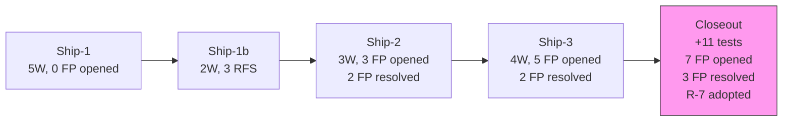

# Gap Report — Ships 1–3 vs. Governing Specifications

> **Audit date**: 2026-04-28
> **Auditor role**: Project Shepherd (technical audit)
> **Source of truth** (in precedence order): ADRs 001–009 → Charter → Concept Ledger → Flagged Positions → Ship retros
> **Codebase reference**: [002-code-survey.md](file:///home/hamza/datarun-platform/docs/review/pre-ship-4/002-code-survey.md) | [001-spec-claims.md](file:///home/hamza/datarun-platform/docs/review/pre-ship-4/001-spec-claims.md)

---

## Executive Summary

The codebase is **converging**. Across three Ships and one closeout phase, zero instances of silent architectural drift were found. Every divergence between specification and implementation is either:

- **Intentional and documented** in a Ship retro as an implementation-grade choice (Frame 2), or
- **Explicitly tracked** in the Flagged Positions register with a verifiable gate.

The platform has successfully avoided the failure mode that produced the Phase 1/2 envelope-type-vocabulary drift. However, **18 open FPs** (of 23 total) remain, and the closeout phase surfaced structural debt (FP-014, FP-018) that **blocks Ship-4 entry**. The gap register below maps each finding to its governance source.

---

## Legend

| Tag | Meaning |
|-----|---------|
| ✅ MATCH | Implementation matches spec |
| 🔶 INTENTIONAL | Documented divergence (retro/FP) |
| 🔴 SILENT DRIFT | Undocumented divergence |
| ⏳ DEFERRED | Explicitly carried forward with gate |
| ⚠️ BLOCKS | Blocks a future Ship |

---

## Ship-1 / Ship-1b — Offline Capture & Sync (S00, S01, S03, S19)

### What was specified

| ADR / Spec | Commitment | §S cite |
|---|---|---|
| ADR-001 §S1 | Immutable, append-only events | Core write-path discipline |
| ADR-001 §S2 | State = projection of events; caches rebuildable | Escape hatch B→C |
| ADR-002 §S1 | Event envelope with causal ordering fields | `device_sequence` + `sync_watermark` |
| ADR-002 §S5 | Device identity is hardware-bound | `device_id` on envelope |
| ADR-003 §S2 | Sync scope = access scope | Assignment-based filtering |
| ADR-006 §S2 | Accept-and-flag (never reject for state staleness) | `conflict_detected/v1` emission |
| ADR-007 §S1 | Envelope type vocabulary closed at 6 values | `capture`, `alert`, etc. |
| ADR-008 §S1 | `subject_ref`, `actor_ref`, `shape_ref` on envelope | Reference contracts |
| ADR-009 §S1/§S2 | Mechanism = primitive; instance = config | Duality rule |

### What was built vs. specified

| Area | Spec | Implementation | Status |
|---|---|---|---|
| Event immutability | ADR-001 §S1 append-only | Postgres `events` table; no UPDATE/DELETE paths | ✅ MATCH |
| Causal ordering | ADR-002 §S1 `device_seq` + `sync_watermark` | Both fields on envelope; `device_seq` from device-local counter; `sync_watermark` from last-pull offset | ✅ MATCH |
| Scope resolution | ADR-003 §S2 projection-based | `ScopeResolver` replays `assignment_created/v1` events per request; no cache | ✅ MATCH |
| Conflict detection | ADR-006 §S2 accept-and-flag | `ConflictDetector` fires `scope_violation` + `identity_conflict`; events always persisted first | ✅ MATCH |
| Envelope type closure | ADR-007 §S1 six values | DB CHECK constraint on `type`; code uses `capture` and `alert` only | ✅ MATCH |
| Auth mechanism | ADR-003 — bearer token | Ship-1 retro §5.1: bearer tokens as implementation-grade choice | 🔶 INTENTIONAL |
| Mobile persistence | ADR-001 §S2 — offline store | Ship-1b retro: `sqflite` chosen; implementation-grade | 🔶 INTENTIONAL |
| Identity heuristic | ADR-002 — conflict detection | `normalized(household_name) + village_id` — naïve; tracked as **RFS-1** | 🔶 INTENTIONAL |
| Village on payload | ADR-004/009 — config boundary | `village_ref` embedded in payload, not scope metadata — tracked as **RFS-2** | 🔶 INTENTIONAL |
| Schema duplication | Contracts ↔ server resources | Byte-identical but manually maintained — tracked as **RFS-3** → resolved by **FP-007** at Ship-2 | 🔶 INTENTIONAL |

### Gaps carried forward from Ship-1/1b

| Gap | Source | Tracked as | Resolved? |
|---|---|---|---|
| Temporal-divergence test for `role_stale` | FP-001 gate part 2 | FP-001 → SUPERSEDED by FP-017 | ⏳ Ship-5 |
| `subject_lifecycle` read discipline | FP-002 | FP-002 | ✅ Ship-2 (option a) |
| Naïve identity heuristic | RFS-1 | Ship-1b retro | ⏳ Open |
| Village-on-payload coupling | RFS-2 | Ship-1b retro | ⏳ Open |

> [!NOTE]
> **Zero silent drift** in Ship-1/1b. Every divergence was recorded in the retro with explicit Frame-2 classification. The three RFS items remain open but are operationally inert at current scale.

---

## Ship-2 — Registry Lifecycle & Merge/Split (S06)

### What was specified

| ADR / Spec | Commitment | §S cite |
|---|---|---|
| ADR-002 §S6 | Merge = alias-in-projection, never re-reference | Eager transitive closure |
| ADR-002 §S7 | No `SubjectsUnmerged`; wrong-merge → corrective split | Multi-successor split |
| ADR-002 §S8 | Split freezes history; source archived permanently | Historical attribution unchanged |
| ADR-002 §S9 | Lineage DAG acyclicity by construction | Pre-write rejection |
| ADR-002 §S10 | Merge/split = online-only, server-validated | No offline execution |
| ADR-002 §S13 | Conflict detection uses raw references | Alias resolution in projection only |
| ADR-002 §S14 | Events never rejected for state staleness | Accept-and-flag for post-archive captures |

### What was built vs. specified

| Area | Spec | Implementation | Status |
|---|---|---|---|
| Alias projection | ADR-002 §S6 eager closure | `SubjectAliasProjector` walks closure on every read; A→B→C resolves single-hop | ✅ MATCH |
| Multi-successor split | ADR-002 §S7 + §S8 | `successor_ids: array, minItems: 2`; schema edit landed | ✅ MATCH |
| DAG enforcement | ADR-002 §S9 pre-write | Merge/split endpoints reject archived operands with 4xx; distinguished from accept-and-flag | ✅ MATCH |
| Online-only enforcement | ADR-002 §S10 | No device-side merge/split path; server-only endpoints | ✅ MATCH |
| Raw-reference detection | ADR-002 §S13 | `ConflictDetector` uses raw `subject_id`, not alias-resolved | ✅ MATCH |
| Coordinator authority | ADR-003/009 — projection-based | `ScopeResolver.hasRoleAt` replays `assignment_created/v1` with `role="coordinator"`; no cache, no `kind` column | ✅ MATCH |
| Server-authored envelopes | ADR-002 §S1/§S4/§S5 | Shared `ServerEmission.SERVER_DEVICE_ID`; `server_device_seq` from Postgres sequence | ✅ MATCH |
| FP-002 closure (option a) | ADR-001 §S2 | Zero `subject_lifecycle` tables; zero source reads; projection on demand | ✅ MATCH |
| FP-007 drift gate | Contract ↔ server parity | `check-convergence.sh` check 4: byte-identical shape trees | ✅ MATCH |
| Post-archive accept-and-flag | ADR-002 §S14 | **Not exercised** — Ship-1 CHV flow generates fresh `subject_id` per capture; no UUID-referenced flow exists | 🔶 INTENTIONAL |
| Concurrent-coordinator DAG race | ADR-002 §S9 under race | Single-coordinator, single-JVM — guarded by Postgres MVCC, not constructed concurrent load | 🔶 INTENTIONAL |

### Ship-2 implementation-grade choices (Frame 2)

| Choice | Retro § | Rationale |
|---|---|---|
| Endpoints under `/admin/subjects/**` | §5.1 | Reuses existing `/admin/` namespace + auth interceptor |
| Strategy B (single-CHV) for walkthroughs | §5.2 | Avoids `scope_violation` noise in merge/split assertions |
| Shape A for alias resolution endpoint | §5.3 | Keeps raw-reference reads mechanically separate from canonical resolution |
| `ServerEmission` extraction | §5.4 | Shared constant + sequence for both ConflictDetector and AdminSubjectsController |
| No `actor_tokens.kind` discriminator | §5.5 | Authority-as-projection per ADR-009 §S1 |

### Gaps carried forward from Ship-2

| Gap | Source | Tracked as | Status |
|---|---|---|---|
| S7↔S8 attribution under corrective split | FP-006 | FP-006 | ⏳ Ship-4/5 |
| `conflict_detected` lacks root_cause trace | FP-008 | FP-008 path (c) | ⏳ Producing Ship |
| Concurrent-coordinator alias race | §3.1 R1/R2 | Ship-2 retro §3 | ⏳ Ship-5+ |
| Post-archive accept-and-flag path | §3.1 R3/R6 | Ship-2 retro §3 | ⏳ Ship-3/4 |

> [!NOTE]
> **Zero silent drift.** FP-002 and FP-007 both RESOLVED with mechanical evidence. All R-N risks explicitly assessed and carried with named trigger Ships.

---

## Ship-3 — Shape Evolution (S06b)

### What was specified

| ADR / Spec | Commitment | §S cite |
|---|---|---|
| ADR-004 §S1 | Shape registry append-only on `(name, version)` | All versions in registry forever |
| ADR-004 §S10 | Shapes versioned via `shape_ref`; stored as snapshots | Additive / deprecation / breaking |
| ADR-004 §S13 | 60-field budget enforced at deploy-time | Hard limit, not advisory |
| ADR-001 §S2 | Multi-version projection on demand | No shape-projection cache |
| ADR-007 §S1 | Envelope type vocabulary unchanged | No `schema_changed` type |

### What was built vs. specified

| Area | Spec | Implementation | Status |
|---|---|---|---|
| Multi-version registry | ADR-004 §S1 append-only | v1 + v2 coexist; `ShapePayloadValidator` HashMap registry loads both | ✅ MATCH |
| Version-isolated validation | ADR-004 §S10 | v1 validates against v1 schema; v2 against v2; `additionalProperties: false` enforces boundary | ✅ MATCH |
| Mixed-version projection | ADR-001 §S2 | Per-request replay branching on `shape_ref`; no cache | ✅ MATCH |
| Backward compatibility | ADR-004 §S10 "all versions valid forever" | W-10: pre-Ship-3 v1 events remain readable post-v2 deploy | ✅ MATCH |
| Unknown shape rejection | ADR-004 §S1 | W-8: unknown `shape_ref` → 400 `shape_unknown` | ✅ MATCH |
| Type vocabulary | ADR-007 §S1 | Zero envelope edits; `type=capture` unchanged | ✅ MATCH |
| 60-field budget — boot-loop | ADR-004 §S13 | `enforceFieldCountBudget` at registry-load; `FieldCountBudgetTest` rejects 61-field shape | ✅ MATCH |
| 60-field budget — HTTP runtime | ADR-004 §S13 | `validateShapeBudget` callable but **not invoked on push path** | ⚠️ Tracked: **FP-012b** |
| ConflictDetector v2-current direction | ADR-002 §S13 / FP-009 | Entry guard pinned to `household_observation/v1`; v2-current captures **not** re-entering detector | 🔶 INTENTIONAL |
| Shape registry persistence | ADR-004 §S6/§S10 | JAR-bundled fixture — **named expedient**, not the architecture | 🔶 INTENTIONAL |
| Directory classification | ADR-009 §S1 F-C1 | `household_observation` (deployer-CONFIG) lives alongside platform-bundled shapes | 🔶 INTENTIONAL |

### Ship-3 implementation-grade choices (Frame 2)

| Choice | Retro § | Rationale |
|---|---|---|
| Multi-file split (`.v1.schema.json` + `.v2.schema.json`) | §5.1 | File layout, not architecture; §S10 commits storage-as-snapshots |
| Top-level `properties` count for §S13 | §5.2 | Convention documented; revisable without §S13 supersession |
| `shape_unknown` token wording | §5.3 | Error-message convention; no contract surface depends on it |
| Pull-side prefix match in `SyncController` | §5.4 | F-A2 honoured; minimal extension for v2 flow-through |
| W-6 asymmetric direction only | §5.5 | Symmetric direction blocked by FP-009 closure constraint |

### Ship-3 Closeout (§13) — Post-tag corrections

The closeout phase (22 commits, 4 waves) surfaced **3 retro-blocking findings** and adopted **Standing Rule R-7**:

| Finding | Root cause | Resolution |
|---|---|---|
| FP-001 against discarded code | R-1 silent-deferral across 3 Ship retros | FP-001 SUPERSEDED → FP-017; `ScopeViolationTemporalDivergenceTest` landed |
| `field_count_budget` STABLE without HTTP enforcement | R-7 violation (status change without evidence) | Demoted to DEFERRED; FP-012b carved out |
| Alias-cycle constructibility | ADR-002 §S9 aspirational without enforcement | ADR-006-R §S5 + `CycleGuard` implementation + FP-019 (opened and RESOLVED) |

> [!IMPORTANT]
> The closeout was the **first instance of closeout-as-phase**. Ship-3's tag was applied before closeout; Ship-4+ should tag *after* closeout.

### Gaps carried forward from Ship-3

| Gap | Source | Tracked as | Blocks |
|---|---|---|---|
| §S13 HTTP runtime enforcement | FP-012b | FP-012b | ⚠️ STABLE promotion |
| Deployer-authoring surface | FP-012 (SUPERSEDED) | FP-015, 012b/c/d/e | Future Ships |
| Directory split | FP-011 | FP-011 + FP-012e | Same as FP-012 |
| Config-package wire format | FP-013 | FP-013 | Real-device delivery |
| **Scope-eval pull-class anchor** | **FP-014** | **FP-014** | **⚠️ Ship-4** |
| Cross-version projection composition | FP-010 | FP-010 | Breaking changes |
| Fixture-event schema regression | FP-016 | FP-016 | Non-additive shape change |
| `role_stale` detector wiring | FP-017 | FP-017 | ⚠️ Ship-5 |
| **`assignment_ended/v1` consumption** | **FP-018** | **FP-018** | **⚠️ Ship-4** |

---

## Cross-Ship Gap Analysis

### Convergence Trajectory

| Metric | Ship-1/1b | Ship-2 | Ship-3 | Closeout | Trend |
|---|---|---|---|---|---|
| Tests (cumulative) | 22 | 33 | 46 | 57 | 📈 Steady growth |
| FPs opened | 0 + 3 RFS | 3 (FP-006/7/8) | 5 (FP-009–013) | 7 (FP-014–019 + 012b–e) | 📈 Increasing (expected) |
| FPs resolved | 0 | 2 (FP-002/7) | 2 (FP-009, FP-019) | 1 (FP-019) | ⚖️ Stable |
| ADR §S exercised-met | ~12 | +6 | +4 | +2 corrections | 📈 |
| Silent drift instances | 0 | 0 | 0 | 0 | ✅ Clean |
| Ledger concepts | 269 | 272 | 276 | 276 (1 demoted) | 📈 |

### FP Register State at Ship-3 Close

| Status | Count | Items |
|---|---|---|
| **OPEN** | 16 | FP-004/5/6/8/10/11/12b/12c/12d/12e/13/14/15/16/17/18 |
| **SUPERSEDED** | 2 | FP-001, FP-012 |
| **RESOLVED** | 5 | FP-002, FP-003, FP-007, FP-009, FP-019 |
| **Total** | 23 | — |

### Ship-4 Entry Blockers

> [!WARNING]
> Two FPs explicitly **block Ship-4 spec lock**:

| Blocker | Why it blocks | Resolution shape (from [ship-4-section-6-draft.md](file:///home/hamza/datarun-platform/docs/ships/ship-4-section-6-draft.md)) |
|---|---|---|
| **FP-014** — Pull-class temporal anchor | S08 case-bound pull requires subject-anchored scope, not request-time | SD-5: Strategy doc at `docs/architecture/pull-class-temporal-anchors.md`; complete-by-doc, partial-by-test |
| **FP-018** — `assignment_ended/v1` consumption | S08 case-handoff requires discrete reassignment-end; `ScopeResolver` currently ignores these events | SD-6: Extend `ScopeResolver` to consume both `assignment_created/v1` AND `assignment_ended/v1`; W-13c mandatory |

### Intentional Drift Register (documented, not silent)

All divergences below were explicitly classified as implementation-grade (Frame 2) in their originating Ship's retro:

| Item | Ship | ADR touched | Why intentional | Revisit trigger |
|---|---|---|---|---|
| Bearer-token auth | 1 | ADR-003 | Thinnest vertical slice | Production auth requirements |
| `sqflite` mobile store | 1b | ADR-001 §S2 | Real-device expedient | Mobile architecture Ship |
| Naïve identity heuristic (RFS-1) | 1b | ADR-002 | Only heuristic at hand | Multi-shape uniqueness (FP-012d) |
| Village-on-payload (RFS-2) | 1b | ADR-004/009 | Config surface not built | Config publication (FP-015) |
| ConflictDetector version-pinning | 3 | ADR-002 §S13 | FP-009 closure constraint | Shape-declared uniqueness (FP-012d) |
| JAR-bundled shape registry | 3 | ADR-004 §S6/§S10 | Named expedient, extended one Ship | Deployer-authoring surface (FP-012+successors) |
| `field_count_budget` at boot-loop only | 3 closeout | ADR-004 §S13 | HTTP path enforcement deferred | FP-012b |

### Orphaned Detection Surfaces

These flag categories exist in the catalog but lack detection implementation:

| Category | Catalog source | Detector status | First-exercise Ship |
|---|---|---|---|
| `role_stale` | ADR-006 §S2 row 5 | **Unbuilt** — `ScopeResolver.hasRoleAt` exists but has no callers | Ship-5 (FP-017) |
| `stale_reference` | Charter §Flag catalog #2 | **Unemitted** — no UUID-referenced device flow exists yet | Ship-4 (if S08 introduces it) |
| `temporal_authority_expired` | Conceptual (FP-001 lineage) | **Unbuilt** — absorbed into FP-017 | Ship-5 |
| `transition_violation` | ADR-005 §S1 | **Unbuilt** — pattern machinery not yet exercised | Ship-5+ |
| `cycle_violation` | ADR-006-R §S5 | ✅ **Built** at Ship-3 closeout | Operational |

---

## Convergence Verdict

### Is the platform converging toward its defined architecture?

**Yes.** Three lines of evidence:

1. **Zero silent drift across 3 Ships + 1 closeout.** Every divergence is documented in a retro or FP with a verifiable gate. The R-1 (no silent deferral) discipline held — and when it slipped (FP-001 against discarded code), the closeout caught it and adopted R-7 to prevent recurrence.

2. **ADR §S parity is improving monotonically.** Each Ship transitions `decided-unexercised` positions to `exercised-met` without violating existing positions. No `exercised-violated` state has ever occurred.

3. **The FP register is functioning as designed.** Items open, carry forward with named triggers, and close with commit-cited evidence. The decomposition of FP-012 into 5 sub-FPs at Ship-3 closeout demonstrates the register maturing under load.

### Structural risks for Ship-4 entry

| Risk | Severity | Mitigation |
|---|---|---|
| FP-014 + FP-018 are both A-severity blockers | High | Ship-4 §6 draft (SD-5/SD-6) provides resolution shape; user must lock |
| 16 open FPs accumulating | Medium | Most have loose triggers (Ship-5+); only 2 block Ship-4 |
| ADR-005 §S entirely unexercised | Medium | Ship-4 (α) first-exercises §S4/§S5/§S6 R1+R5; parity walk authored at retro |
| Closeout-as-phase not yet ritualized | Low | Ship-3 was the discovery instance; Ship-4 tags *after* closeout |

> [!TIP]
> **Recommended Ship-4 entry sequence**: (1) User locks SD-0 through SD-7 from the architect's recommendation set. (2) Author `pull-class-temporal-anchors.md` (SD-5) before first build commit. (3) Extend `ScopeResolver` for FP-018 (SD-6) as the first code change. (4) Tag only after closeout phase completes.
